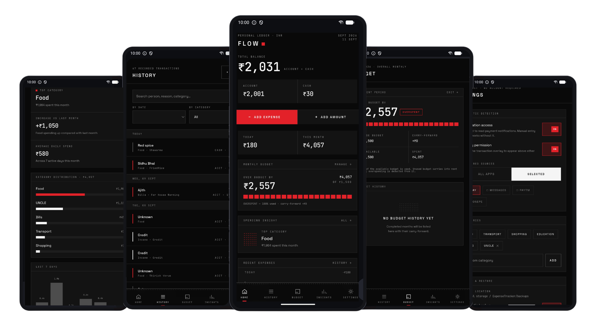
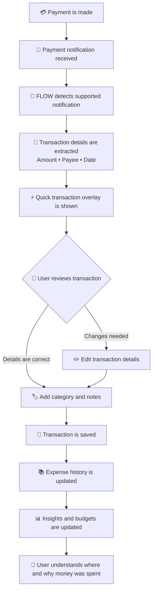
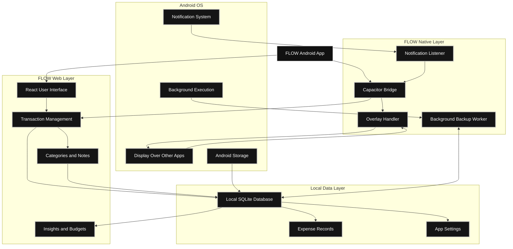

[](https://github.com/emiljinx-core/flow-expense-tracker/blob/main/LICENSE)
[](https://github.com/emiljinx-core/flow-expense-tracker/releases)

[](https://github.com/emiljinx-core/flow-expense-tracker/releases)


# FLOW: Expense Tracker

FLOW is a simple, local-first expense tracker that automatically detects transaction notifications and brings them up on your screen for review. You can edit the transaction and organize it into your expense records with categories, notes, and additional context, making it easier to understand where your money goes.<br/>

<br>

<div style="display:flex;" >
 <a href="https://github.com/emiljinx-core/flow-expense-tracker/releases/latest/download/FLOW-v1.0.0.apk">
        
      </a>
<a href="https://t.me/flow_app_official">
        
      </a>
</div>
<p align="center"> 
  <a href="#features"> Features </a> -
  <a href="#architecture"> Architecture </a> -
  <a href="#installation"> Installation </a> -
  <a href="#tech-stack"> Tech Stack </a> -
  <a href="#license"> License</a>
</p>
</br>

## SNAPSHOTS
<div style="display:flex;" >
<p align="center">
  
</p>
</div>

## WHY FLOW

Payment apps show **who** received your money, **how much** you paid, and **when** — but weeks later, they may not explain why you spent it.

> *FLOW turns transaction notifications into expenses you can understand.*

Instead of manually creating every record, FLOW helps you:

<table>
  <tr>
    <td align="center">🔔<br><b>Detect</b></td>
    <td align="center">👀<br><b>Review</b></td>
    <td align="center">🏷️<br><b>Categorize</b></td>
    <td align="center">📝<br><b>Add Context</b></td>
    <td align="center">💾<br><b>Save</b></td>
  </tr>
</table>

With FLOW, you can:

- See how much you spend and where your money goes
- Organize expenses with categories and notes
- Remember the reason behind individual payments
- Review your spending patterns over time
- Share expense records when needed

> *Less manual entry. More financial clarity.*
</br>

## FEATURES

Managing expenses is not only about recording transactions. Traditional expense trackers usually require users to open the app and enter each payment manually. When an expense is forgotten, the record becomes incomplete, and users may later struggle to remember where their money went or why they spent it.

FLOW reduces this problem by combining automatic transaction detection with quick review, personal spending context, budgeting, and insights. Instead of relying entirely on memory and manual entry, FLOW helps users capture transactions, understand their purpose, and make better financial decisions from a more complete spending history.

<table>
  <tr>
    <td>🔔 <b>Smart Transaction Detection</b><br>Detects supported notifications for both sent and received payments.</td>
    <td>⚡ <b>Instant Transaction Overlay</b><br>Shows detected payment details in a quick on-screen overlay.</td>
  </tr>
  <tr>
    <td>✏️ <b>Transaction Review & Editing</b><br>Edit the amount, sender, receiver, category, and other details.</td>
    <td>🏷️ <b>Spending Context & Categorization</b><br>Assign categories and add notes to individual transactions.</td>
  </tr>
  <tr>
    <td>🔔 <b>Custom Notification Sources</b><br>Select which supported payment apps FLOW should monitor.</td>
    <td>📚 <b>Expense History & Insights</b><br>Access saved records and identify spending patterns.</td>
  </tr>
  <tr>
    <td>💰 <b>Budget Management</b><br>Set spending limits and monitor expenses against them.</td>
    <td>🔒 <b>Backup & Expense Sharing</b><br>Back up expense records and enables expense sharing.</td>
  </tr>
</table>

Together, these features make FLOW more than a basic expense log. Automatic detection reduces repetitive data entry, while the overlay and editing tools make recording payments faster and more flexible. Categories, notes, history, insights, and budgets help users make better decisions from their records, while backup and sharing make those records easier to manage and use when needed.
</br>

## HOW FLOW WORKS

FLOW reduces repetitive manual entry by detecting supported payment notifications, extracting transaction details, and allowing users to complete the missing context before saving the expense.



### Workflow Overview

- **Transaction Detection:** FLOW detects supported payment notifications from selected notification sources.
- **Information Extraction:** Available details such as amount, payee, date, and transaction type are extracted.
- **Quick Review:** The transaction overlay allows users to review the payment without manually opening the app.
- **Editing and Context:** Users can correct details, choose a category, and add a note explaining the purpose of the expense.
- **Saving:** The completed transaction is saved to the expense history.
- **Insights and Budgets:** The saved transaction updates spending summaries, insights, and budget progress.
- **Spending Understanding:** FLOW helps users remember not only how much they spent, but also where and why they spent it.
<br/>

## ARCHITECTURE

FLOW uses a hybrid Android architecture that combines a React-based web interface with native Android services.



### Architecture Overview

- **Android OS:** Provides the system-level notification and background execution capabilities used by FLOW.
- **Notification Listener:** Monitors selected supported payment notifications and passes relevant transaction information to the app.
- **Capacitor Bridge:** Connects the React web layer with native Android functionality.
- **Overlay Handler:** Displays detected transaction details through a quick overlay without requiring the user to open the main app.
- **Background Backup Worker:** Handles backup-related background tasks and works with the local expense database.
- **React User Interface:** Provides the main screens for viewing, adding, editing, and managing transactions.
- **Transaction Management:** Processes transaction details such as amount, sender, receiver, payee, date, and transaction type.
- **Categories and Notes:** Allows users to add personal context and explain the purpose of each transaction.
- **Local SQLite Database:** Stores expense records and related information locally for quick access and offline use.
- **Insights and Budgets:** Uses saved transaction data to display spending patterns, summaries, and budget progress.

### Data Flow

1. A payment app generates a transaction notification.
2. Android makes the notification available to FLOW’s notification listener.
3. FLOW extracts the available transaction information.
4. The native layer sends the information to the React interface through the Capacitor bridge.
5. The transaction overlay allows the user to review or edit the detected details.
6. The user can add a category and personal note.
7. The completed transaction is saved in the local SQLite database.
8. Expense history, insights, and budget calculations are updated using the saved record.

### Design Approach

FLOW separates Android-specific operations from the main user interface. This allows the app to use native Android capabilities when required while keeping the expense management experience inside the React-based web layer. Local storage keeps the core expense workflow available without depending on a remote server.
<br/>

## INSTALLATION

01. **[Download from GitHub](https://github.com/emiljinx-core/flow-expense-tracker/releases/latest/download/FLOW-v1.0.0.apk)**
02. **[Download from Telegram](https://t.me/flow_app_official)**
03. Open the downloaded `.apk` file.
04. Allow installation from unknown sources if your Android device requests it.
05. Install & Open FLOW.
06. Grant the required permissions when prompted.
07. Enable **Notification Access** for FLOW from your device settings so the app can detect supported payment notifications.
08. Enable **Display over other apps** or **Appear on top** for FLOW so transaction overlays can appear when a payment notification is detected.
89. Return to FLOW and confirm that both permissions are enabled.
10. Select the payment apps or notification sources that FLOW should monitor.
11. Make a test transaction and check whether FLOW detects and displays it correctly.

> *Note:** The exact names and locations of these settings may vary depending on your Android device manufacturer and Android version.
<br/>

## PERMISSIONS

| Permission | Purpose |
|---|---|
| `BIND_NOTIFICATION_LISTENER_SERVICE` | Required to read incoming banking and payment notifications to detect transactions automatically. |
| `SYSTEM_ALERT_WINDOW` | Required to display the transaction review overlay directly on your screen when a transaction happens while you are using other apps. |
| `POST_NOTIFICATIONS` | Required to send you fallback notifications when the overlay cannot be displayed. |
| `INTERNET` | Required by Capacitor for internal web-view routing and rendering, though no data is transmitted externally. |
<br/>

## PRIVACY

FLOW takes a strict local-first approach to your data. All parsed expense records, budgets, and categories are saved directly to a local SQLite database residing securely on your device.

Because FLOW must read your notifications to automate transaction tracking, you must grant it Notification Access. Please note that granting this permission allows the app's native service to read the contents of your notifications locally to extract transaction data.
<br/>

## TECH STACK

FLOW is built using a hybrid web-and-native architecture. The React-based web layer manages the user interface and expense management features, while Capacitor and native Android components provide access to Android-specific capabilities such as notification detection, overlays, and background tasks.

| Technology | Purpose |
|---|---|
| **React** | Builds the web-based user interface using reusable components for transaction management, expense history, categories, budgets, and insights. |
| **TypeScript** | Provides type-safe frontend logic, improves code reliability, and makes transaction data and application state easier to manage. |
| **Vite** | Handles frontend development, fast hot-module replacement, project bundling, and production builds. |
| **Tailwind CSS** | Provides utility-based styling for responsive layouts, reusable design patterns, spacing, typography, and consistent UI styling. |
| **Capacitor** | Connects the React web application with native Android functionality through a bridge and allows the web layer to communicate with native services. |
| **Android (Kotlin)** | Implements Android-specific features such as notification listening, transaction detection, overlay handling, and background execution. |
| **Notification Listener** | Receives supported payment notifications and makes relevant transaction information available to FLOW. |
| **Overlay Service** | Displays detected transaction details through a quick overlay without requiring users to open the main application. |
| **SQLite** | Stores transaction records, categories, notes, budgets, and other structured expense data locally on the device. |
| **Capacitor Preferences** | Stores lightweight application settings and user configurations such as selected notification sources and preference values. |
| **Background Worker** | Handles background tasks such as backup-related operations while working with the locally stored expense data. |

### Technology Responsibilities

- **Frontend Layer:** React, TypeScript, Vite, and Tailwind CSS manage the user interface and expense-related workflows.
- **Native Android Layer:** Kotlin handles Android services that cannot be implemented reliably through the web layer alone.
- **Communication Layer:** Capacitor connects the React interface with native Android services.
- **Data Layer:** SQLite stores structured transaction and budget records locally.
- **Settings Layer:** Capacitor Preferences stores lightweight configuration values and application settings.
- **Background Layer:** Android background workers support tasks that may need to run outside the main application screen.

### Why This Stack?

This combination allows FLOW to maintain a modern and responsive interface while still accessing important Android capabilities. The web layer makes the application easier to develop and maintain, while the native layer enables notification detection, quick overlays, and background operations. Local storage also allows expense records to remain available on the device without requiring the core tracking workflow to depend on a remote server.
<br/>

## PROJECT STRUCTURE

The FLOW project is organized into separate native Android, frontend, configuration, and asset directories. This separation keeps the user interface, Android-specific services, data handling, and project configuration easier to maintain.

```text
flow-expense-tracker/
├── android/
│   └── app/src/main/java/com/nothing/expensetracker/
│       ├── ExpenseNotificationService.kt
│       ├── TransactionOverlayService.kt
│       ├── TransactionParser.kt
│       ├── NotificationBridgePlugin.kt
│       └── backup/
│           └── BackupWorker.kt
│
├── src/
│   ├── components/
│   │   └── Reusable React UI components
│   ├── hooks/
│   │   └── Reusable React hooks and state logic
│   ├── lib/
│   │   └── Utility functions and application logic
│   ├── plugins/
│   │   └── Capacitor and native plugin integrations
│   └── routes/
│       └── Application pages and navigation
│
├── public/
│   └── Static assets and public resources
│
├── resources/
│   ├── screenshots/
│   └── badges/
│
├── capacitor.config.ts
├── package.json
├── vite.config.ts
├── tsconfig.json
└── README.md
```

### Important Directories

- **`android/`**  
  Contains the native Android project and Kotlin-based services required for notification handling, transaction overlays, parsing, and background operations.

- **`ExpenseNotificationService.kt`**  
  Handles supported payment notifications received from Android.

- **`TransactionOverlayService.kt`**  
  Manages the quick overlay used to display and review detected transaction details.

- **`TransactionParser.kt`**  
  Processes notification content and extracts available transaction information.

- **`NotificationBridgePlugin.kt`**  
  Connects native Android notification functionality with the React application through Capacitor.

- **`backup/BackupWorker.kt`**  
  Handles background backup-related operations.

- **`src/`**  
  Contains the main React and TypeScript application code.

- **`components/`**  
  Contains reusable interface elements used throughout the application.

- **`hooks/`**  
  Contains reusable React hooks for managing state, behavior, and application logic.

- **`lib/`**  
  Contains shared utilities, database logic, helper functions, and other core application functionality.

- **`plugins/`**  
  Contains integrations between the frontend and native Capacitor functionality.

- **`routes/`**  
  Contains application pages and route-related components.

- **`resources/`**  
  Stores project assets such as screenshots, badges, and other README resources.

### Configuration Files

| File | Purpose |
|---|---|
| **`capacitor.config.ts`** | Configures Capacitor and the connection between the web application and native Android project. |
| **`package.json`** | Defines project dependencies, scripts, and package information. |
| **`vite.config.ts`** | Configures Vite development and production build behavior. |
| **`tsconfig.json`** | Defines TypeScript compiler settings and project-level type checking. |
| **`README.md`** | Contains project documentation, installation instructions, architecture, features, and usage information. |
<br/>

## CONTRIBUTING

Contributions are welcome! If you would like to improve FLOW, fix a bug, or add a new feature, you can fork the repository and work on your own copy.

### Getting Started

1. **Fork the repository** on [GitHub](https://github.com/emiljinx-core/flow-expense-tracker).

2. **Clone the repository locally:**

   ```python
   git clone https://github.com/emiljinx-core/flow-expense-tracker.git
   cd flow-expense-tracker
   ```

3. **Install the project dependencies:**

   ```python
   npm install
   ```

4. **Create a new branch** for your feature or bug fix:

   ```python
   git checkout -b feature-name
   ```

5. **Run the local development server:**

   ```python
   npm run dev
   ```

6. **Build and test the Android application:**

   If you modify native Kotlin code or want to test the complete Android experience:

   ```python
   npm run build
   npx cap sync android
   cd android
   .\gradlew.bat assembleDebug
   ```

7. **Test your changes** on an Android device or emulator. Make sure existing features continue to work and your changes do not introduce new issues.

8. **Commit and push your changes** to your fork:

   ```python
   git add .
   git commit -m "Describe your changes"
   git push origin feature-name
   ```

9. **Open a pull request** from your branch to the [main FLOW repository](https://github.com/emiljinx-core/flow-expense-tracker).

### Contribution Guidelines

- Keep changes focused and clearly organized.
- Follow the existing project structure and coding style.
- Test frontend and Android changes before submitting a pull request.
- Update the documentation when introducing new features or changing existing behavior.
- Do not include private data, API keys, or unnecessary generated files.
- Clearly explain the purpose of your pull request.
- Include relevant screenshots when applicable.

Every contribution helps make FLOW more useful, reliable, and easier to maintain.
<br/>

## BUG REPORTS AND FEATURE REQUESTS

FLOW is still evolving, and some features may have rough edges. If you encounter a bug or have an idea for improvement, please share it through GitHub.

### Bug Reports

When submitting a bug report, please include:

- **Android version:** For example, Android 13 or Android 14.
- **FLOW version:** For example, `v1.0.0`.
- **Steps to reproduce:** Explain exactly what you clicked or did before the issue occurred.
- **Expected result:** Describe what you expected to happen.
- **Actual result:** Describe what happened instead.
- **Screenshots or screen recordings:** Include them when they help explain the issue.

You can submit a bug report through the [GitHub Issues](https://github.com/emiljinx-core/flow-expense-tracker/issues) section.

### Feature Requests

Have an idea that could make FLOW more useful? Open a feature request and explain:

- What feature you would like to see.
- What problem it would solve.
- How you think it should work.
- Any examples, screenshots, or references that may help explain your idea.

Please check existing issues before creating a new one to avoid duplicates.

## SUPPORT

For questions, feedback, updates, or general support, use the following channels:

- **Telegram:** [FLOW Official Channel](https://t.me/flow_app_official)
- **GitHub Sponsors:** [Support FLOW](https://github.com/sponsors/emiljinx-core)
- **GitHub Repository:** [emiljinx-core/flow-expense-tracker](https://github.com/emiljinx-core/flow-expense-tracker)
- **Bug Reports and Feature Requests:** [GitHub Issues](https://github.com/emiljinx-core/flow-expense-tracker/issues)

If you find FLOW useful, consider supporting the project through [GitHub Sponsors](https://github.com/sponsors/emiljinx-core).

## LICENSE

FLOW is licensed under the **GNU General Public License v3.0**.

See the [LICENSE](LICENSE) file for the complete license terms.
---
<br/>

<p align="center">
  Made with ❤️ by <a href="https://github.com/emiljinx-core">Emil Jinu</a>
</p>

<p align="center">
  If FLOW helped you, consider giving the project a ⭐ on GitHub.
</p>
