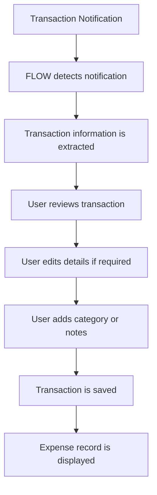
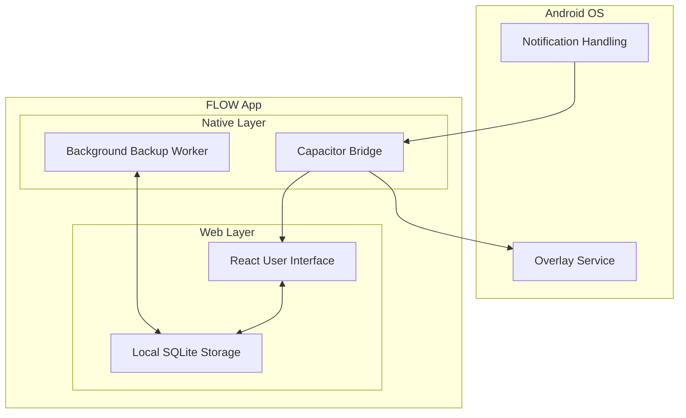

[](https://github.com/emiljinx-core/flow-expense-tracker/blob/main/LICENSE)
[](https://github.com/emiljinx-core/flow-expense-tracker/releases)

[](https://github.com/emiljinx-core/flow-expense-tracker/releases)


# FLOW: Expense Tracker

FLOW is a simple, local-first expense tracker that automatically detects transaction notifications and brings them up on your screen for review. You can edit the transaction and organize it into your expense records with categories, notes, and additional context, making it easier to understand where your money goes.<br/>

<br>

<div style="display:flex;" >
 <a href="https://github.com/emiljinx-core/flow-expense-tracker/releases/latest/download/FLOW-v1.0.0.apk">
        
      </a>
<a href="https://t.me/flow_app_official">
        
      </a>
</div>
</br></br>

## SNAPSHOTS
<div style="display:flex;" >
<p align="center">
  
</p>
</div>

## TABLE OF CONTENTS

- [Overview](#overview)
- [Why FLOW](#why-flow)
- [Features](#features)
- [How FLOW Works](#how-flow-works)
- [Architecture](#architecture)
- [Installation](#installation)
- [Permissions](#permissions)
- [Privacy](#privacy)
- [Tech Stack](#tech-stack)
- [Project Structure](#project-structure)
- [Roadmap](#roadmap)
- [Contributing](#contributing)
- [Bug Reports](#bug-reports-and-feature-requests)
- [Support](#support)
- [License](#license)

## OVERVIEW

FLOW is a simple, local-first expense tracker that automatically detects transaction notifications and brings them up on the screen for review. Users can edit transactions and organize them into expense records with categories, notes, and additional context.

## WHY FLOW

Manual expense entry is a repetitive and easily forgotten chore. However, the transaction notifications your phone already receives contain highly useful information like the amount and the payee. 

FLOW brings these supported transactions directly into a frictionless review workflow. Instead of typing out every detail, you are simply presented with the detected information. You can then edit, organize, and add necessary context to the transaction before finally saving it as a clean expense record.

## FEATURES

<table>
  <tr>
    <td>🔔 <b>Transaction notification detection</b><br>Parses incoming payment notifications securely on-device.</td>
    <td>📝 <b>Transaction review</b><br>Presents detected transactions in an intuitive interface for your approval.</td>
  </tr>
  <tr>
    <td>✏️ <b>Transaction editing</b><br>Modify amounts, payees, or dates before committing to the ledger.</td>
    <td>🏷️ <b>Expense categorization</b><br>Sort expenses into customizable categories for better tracking.</td>
  </tr>
  <tr>
    <td>📓 <b>Notes and additional context</b><br>Add specific details to transactions to remember exactly why you spent the money.</td>
    <td>📴 <b>Local-first expense tracking</b><br>All your financial data remains completely on your device.</td>
  </tr>
  <tr>
    <td>📊 <b>Expense records</b><br>View all your finalized transactions in a unified historical timeline.</td>
    <td></td>
  </tr>
</table>

## HOW FLOW WORKS



## ARCHITECTURE



## INSTALLATION

1. **[Download from GitHub](https://github.com/emiljinx-core/flow-expense-tracker/releases/latest/download/FLOW-v1.0.0.apk)**
2. **[Download from Telegram](https://t.me/flow_app_official)**
3. Open the downloaded `.apk` file.
4. Allow installation from unknown sources if your Android device requests it.
5. Install FLOW.
6. Open FLOW.
7. Grant the required permissions when prompted.

## PERMISSIONS

| Permission | Purpose |
|---|---|
| `BIND_NOTIFICATION_LISTENER_SERVICE` | Required to read incoming banking and payment notifications to detect transactions automatically. |
| `SYSTEM_ALERT_WINDOW` | Required to display the transaction review overlay directly on your screen when a transaction happens while you are using other apps. |
| `POST_NOTIFICATIONS` | Required to send you fallback notifications when the overlay cannot be displayed. |
| `INTERNET` | Required by Capacitor for internal web-view routing and rendering, though no data is transmitted externally. |

## PRIVACY

FLOW takes a strict local-first approach to your data. All parsed expense records, budgets, and categories are saved directly to a local SQLite database residing securely on your device.

Because FLOW must read your notifications to automate transaction tracking, you must grant it Notification Access. Please note that granting this permission allows the app's native service to read the contents of your notifications locally to extract transaction data.

## TECH STACK

| Technology | Purpose |
|---|---|
| **React** | Web application user interface |
| **TypeScript** | Strongly typed frontend logic |
| **Vite** | Frontend build tooling |
| **Tailwind CSS** | Styling and responsive design |
| **Capacitor** | Bridge between the web application and native Android capabilities |
| **Android (Kotlin)** | Native notification listening, background workers, and overlay services |
| **SQLite** | Local database for storing all transaction and budget records |
| **Capacitor Preferences** | Lightweight storage for user settings and configurations |

## PROJECT STRUCTURE

```text
flow-expense-tracker/
├── android/
│   └── app/src/main/java/com/nothing/expensetracker/
│       ├── ExpenseNotificationService.kt
│       ├── TransactionOverlayService.kt
│       ├── TransactionParser.kt
│       ├── NotificationBridgePlugin.kt
│       └── backup/BackupWorker.kt
├── src/
│   ├── components/
│   ├── hooks/
│   ├── lib/
│   ├── plugins/
│   └── routes/
├── capacitor.config.ts
├── package.json
└── vite.config.ts
```

## ROADMAP

- [x] Automatic transaction detection
- [x] Unify Expense and Credit records
- [x] Dynamic monitored app selection
- [x] Background JSON backups
- [ ] Comprehensive budgeting features
- [ ] Enhanced spending insights

## CONTRIBUTING

If you want to contribute, fork the repository and work on your own copy! Here is how to get started:

1. **Fork the repository** on GitHub.
2. **Clone the project** locally:
   ```bash
   git clone https://github.com/YOUR-USERNAME/flow-expense-tracker.git
   cd flow-expense-tracker
   ```
3. **Install dependencies:**
   ```bash
   npm install
   ```
4. **Create a branch** for your feature or bug fix:
   ```bash
   git checkout -b feature-name
   ```
5. **Run the local development server:**
   ```bash
   npm run dev
   ```
6. **Build for Android:**
   If you make changes to the native Kotlin code or want to test the full mobile experience:
   ```bash
   npm run build
   npx cap sync android
   cd android
   .\gradlew.bat assembleDebug
   ```
7. **Test your changes** locally on an Android device or emulator to ensure nothing breaks.
8. **Commit your changes and push** to your fork.
9. **Open a pull request** back to this main repository.

## BUG REPORTS AND FEATURE REQUESTS

When submitting a bug report, please include the following information to help us resolve the issue quickly:

- **Android version:** (e.g., Android 13, Android 14)
- **FLOW version:** (e.g., v1.0.0)
- **Steps to reproduce:** Exactly what you clicked or did before the issue occurred.
- **Expected result:** What you thought would happen.
- **Actual result:** What actually happened.
- **Screenshots:** When useful, include screenshots or screen recordings.

## SUPPORT

- Telegram: [https://t.me/flow_app_official](https://t.me/flow_app_official)
- GitHub Sponsors: [https://github.com/sponsors/emiljinx-core](https://github.com/sponsors/emiljinx-core)
- GitHub repository: [https://github.com/emiljinx-core/flow-expense-tracker](https://github.com/emiljinx-core/flow-expense-tracker)

[](https://github.com/sponsors/emiljinx-core)

## LICENSE

FLOW is licensed under the GNU General Public License v3.0.  
See the [LICENSE](LICENSE) file for more information.
implemented; expect rough edges.
